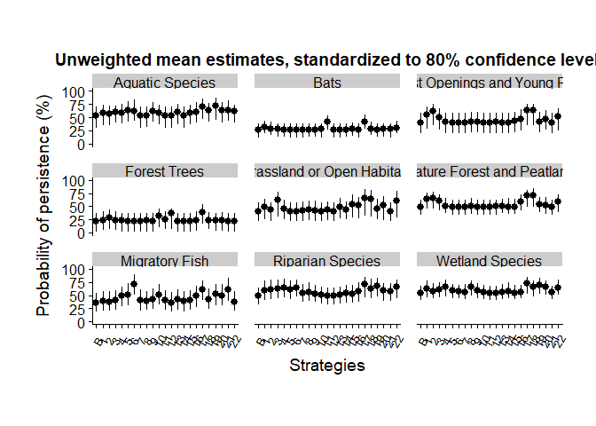

Plot Averaged Performance
================
Abbey Camaclang
10 July 2019

Creates pointrange plots of the standardized mean estimates of probability of persistence (y-axis) for each strategy (x-axis) and for each ecological group (subplots).

It can be used to plot mean estimates that are either unweighted (**Aggregated\_Performance.csv** from *aggregateEstimates.r*) or weighted by feasibility (**Aggregated\_Performance\_weighted.csv** from *getBenefitMatrix.r*)

Load packages

``` r
library(tidyverse)
library(cowplot)
library(gridExtra)
```

Prepare data for plotting

``` r
# Specify which file to read
weighted <- 0

if (weighted == 0) {
  est.file <- "Aggregated_Performance"
} else {
  if (weighted == 1) {
    est.file <- "Aggregated_Performance_weighted"
  } else {
    stop("Must specify if estimates are weighted (1) or not (0)")
  }
}

exp.pop <- read_csv(paste0(est.file, ".csv", sep = ""))

# Organize data into correct format for plotting
exp.pop.long <- exp.pop %>%
  gather(., key = "Estimate", value = "St.Value", -Ecological.Group) %>%
  separate(., Estimate, c("Est.Type", "Strategy"), sep = "[_]", remove = FALSE) %>%
  mutate(Strategy = paste0("S", Strategy)) %>%
  mutate(Strategy = str_replace(Strategy, "SNA", "Baseline")) %>%
  mutate(Strategy = factor(Strategy, levels = unique(Strategy)))

plot.data <- select(exp.pop.long, -Estimate) %>%
  spread(., Est.Type, St.Value)

strat.levels <- levels(plot.data$Strategy)

write_csv(plot.data, paste0(est.file, "_tidy.csv", sep = ""))
```

Plot mean estimates by strategy for all groups

``` r
temp.plot2 <- 
  ggplot(plot.data, aes(x = Strategy, y = Best.guess) ) +
  geom_pointrange(aes(ymin = Lower, ymax = Upper)) +
  theme_cowplot() +  # minimalist theme from cowplot package
  theme(plot.margin = unit(c(1.5, 1, 1.5, 1), "cm"), # top, right, bottom and left margins around the plot area
        panel.spacing = unit(1, "lines"), # adjust margins and between panels of the plot (spacing of 1)
        axis.title.y = element_text(margin = margin(t = 0, r = 10, b = 0, l = 0)), # adjust space between y-axis numbers and y-axis label
        axis.text.x = element_text(size = 10, angle = 60, hjust = 0.5, vjust = 0.5) 
  ) +
  facet_wrap( ~ Ecological.Group, nrow = 3, ncol = 3) +  # create a separate panel for each ecological group
  scale_x_discrete(breaks = strat.levels, labels = c("B", 1:22) ) +
  labs(x = "Strategies",
       y = "Probability of persistence (%)",
       title = "Unweighted mean estimates, standardized to 80% confidence level"
  ) +
  ylim(0, 100) 

print(temp.plot2)
```



Save plot as pdf file

``` r
ggsave(filename=paste0(est.file, "_plot.pdf", sep = ""), temp.plot2, width = 11, height = 8.5, units = "in")
```
